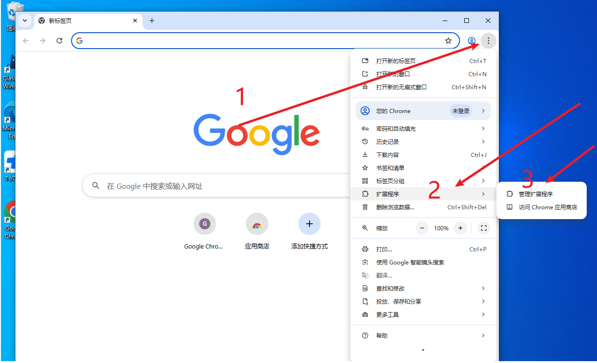
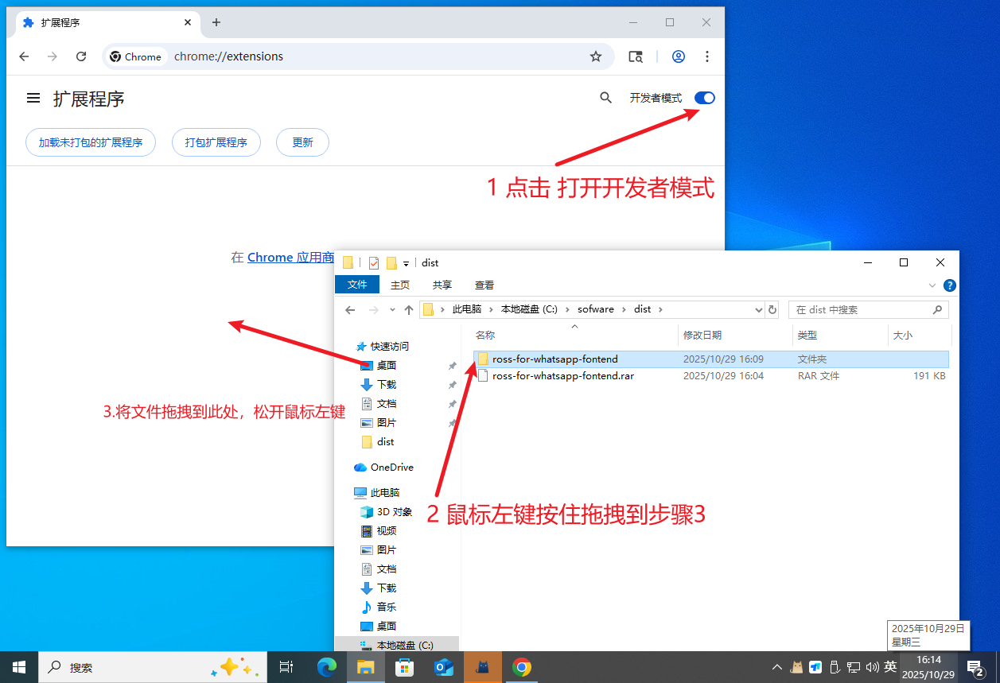
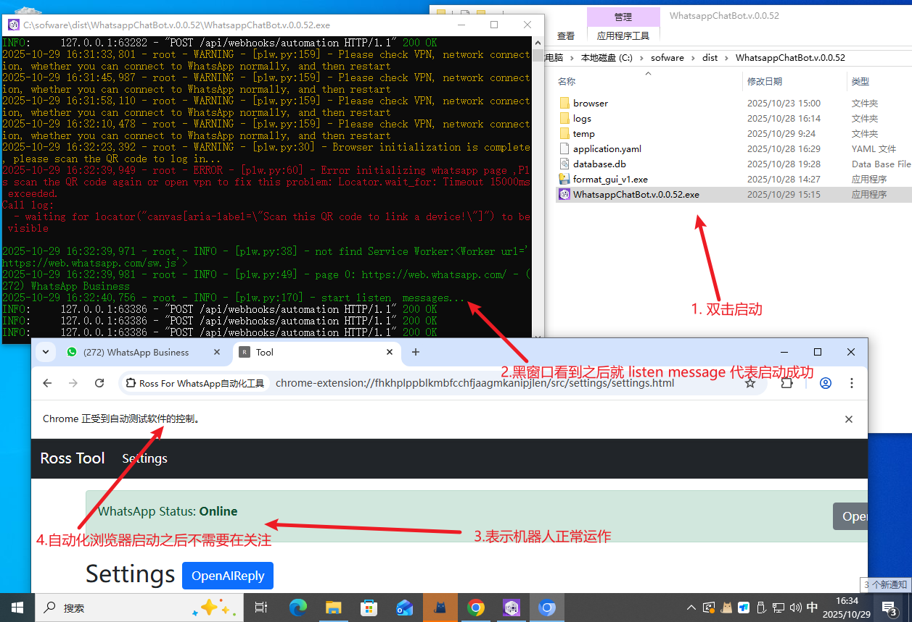
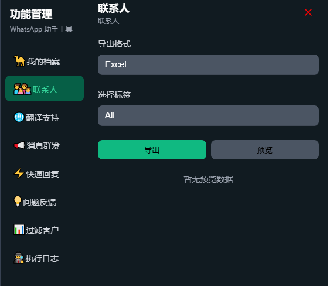

# 1. 解压文件 ross-for-whatsapp-fontend.rar

# 2 打开Chrome浏览器，安装Whatsapp浏览器插件

## 安装成功, 打开Whatsapp 页面登录，已登录按下“F5”刷新

# 打开Whatapp Web 网页

## https://web.whatsapp.com/

# 3. WhatsappChatBot.v.xxx 解压运行 

## 双击运行机器人exe，会弹出一个 《黑色窗口 》和《自动化浏览器》，从自动化浏览器再次扫描登录Whatsapp

# 浏览器插件其他功能

## 联系人
- 按照标签 导出联系 excel表格 
	

- 导出效果
	
## 翻译支持
- 支持多个ai模型翻译
	
- 使用效果
	
## 消息群发
具体使用请到对应功能查看
## 快速回复
具体使用请到对应功能查看
## 问题反馈
具体使用请到对应功能查看
## 过滤客户
具体使用请到对应功能查看
## 执行日志
具体使用请到对应功能查看

# 常见问题
## 尝试关闭黑色窗口重新《WhatsappChatBot.v.0.0.3.exe》双击启动

